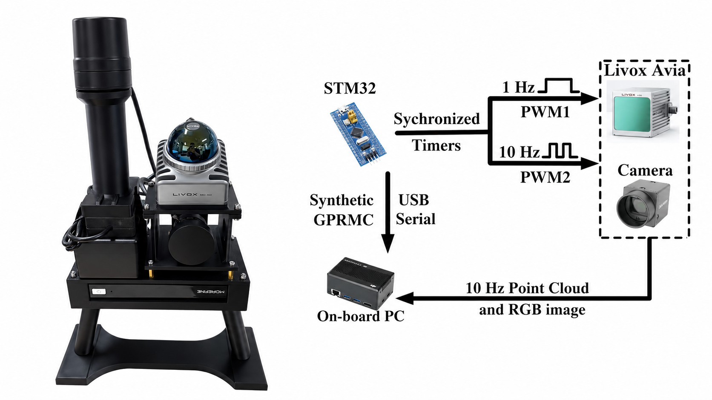
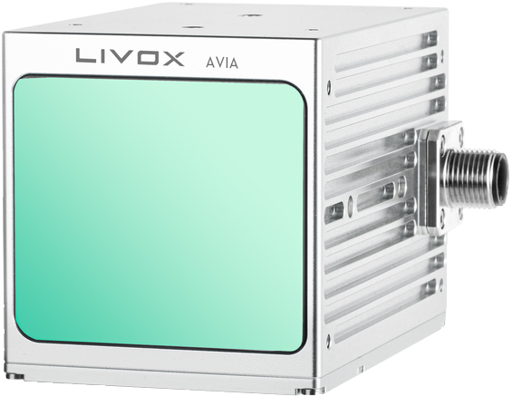
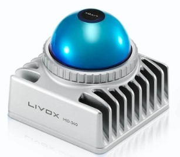
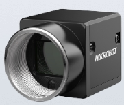
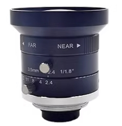

# livox_mvs_ros

***Simple and easy-to-use ROS drivers for Livox and Hikvision devices.***



**Supported Platforms**

- ROS-Noetic on Ubuntu20.04
- ROS-One on Ubuntu22.04


**SDK Packages**

- **livox_ros_driver**: for Livox AVIA.
- **livox_ros_driver2**: for Livox MID360.
- **mvs_ros_driver**: for Hikvision MV-CU013-A0UC.
- **gnss_ros_driver**: for GNSS/RTK UM982.


| Item  | Pics  | Purchasing list  |
| :------------: | :------------: | :------------: |
| Livox AVIA |  | [Livox AVIA](https://store.dji.com/hk-en/product/livox-avia) |
| Livox MID360 |  | [Livox MID360](https://store.dji.com/hk-en/product/livox-mid-360) |
| CMOS |  | [MV-CU013-A0UC ](https://www.hikrobotics.com/en/machinevision/productdetail/?id=6247) |
| Camera Len |  | [ MVL-HF0628M-6MPE](https://m.tb.cn/h.gXmtLRX2UYzGDzH?tk=hIS7WGPOY0y) |
| STM32 |  | [STM32F103C8T6](https://m.tb.cn/h.ggkS9Kp?tk=orRfWz6M784) |


***Note!!! In the current setup, PPS and GPRMC signals are simulated by STM32 board rather than provided by a real GNSS receiver. Therefore, GNSS/RTK data are synchronized in software and their timestamps are compensated and aligned with the STM32-based time reference.***


## Third-party

- [Livox-SDK](https://github.com/Livox-SDK/Livox-SDK): for Livox AVIA.
- [Livox-SDK2](https://github.com/Livox-SDK/Livox-SDK2): for Livox MID360.


## Run

```bash
mkdir -p ws_sensor/src
cd ws_sensor/src
git clone git@github.com:zhan994/livox_mvs_ros.git
cd livox_mvs_ros/livox_ros_driver2
./build.sh ROS1

cd ../../..
source devel/setup.bash

# for indoor
roslaunch start_all start_mvs_mid360.launch

# for outdoor, using gnss_ros_driver for um982
# sudo chmod 777 <serial_um982>
roslaunch start_all start_mvs_mid360_gnss.launch
```

You can easily view trajectory of gnss data recorded as `sensor_msgs/NavSatFix`.

```bash
cd <path-to-ws>/src/livox_mvs_ros/gnss_ros_driver/scripts/
python3 plot_fix_bag.py <path-to-bag> --plot-3d
```

***Note!!! For Livox AVIA or other sensors requiring serial communication (such as via CH340), please run the command `sudo apt remove brltty` to prevent serial connection interruptions.***


## Related Work

- [LIV_handhold: LiDAR_Inertial_Visual_Handhold](https://github.com/xuankuzcr/LIV_handhold)
- [FAST-Calib: LiDAR-Camera Extrinsic Calibration in One Second](https://github.com/hku-mars/FAST-Calib)
- [FAST-LIVO2: Fast, Direct LiDAR-Inertial-Visual Odometry](https://github.com/hku-mars/FAST-LIVO2)
